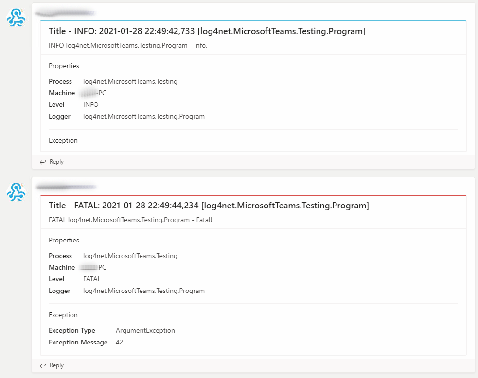

[](https://www.nuget.org/packages/log4net.MicrosoftTeams/)
[](https://jeroenmaes.visualstudio.com/Demo/_build/latest?definitionId=5&branchName=master)
# log4net.MicrosoftTeams
A log4net appender that writes to Microsoft Teams.

# Output


# Usage
```xml
<appender name="myMicrosoftTeamsAppender" type="log4net.MicrosoftTeams.MicrosoftTeamsAppender, log4net.MicrosoftTeams">
  <WebhookUrl value="" /> <!-- Your MicrosoftTeams channel to post to -->
  <titleLayout> 
    <conversionPattern value="Title - %p: %date [%c]" />
  </titleLayout>
  <layout type="log4net.Layout.PatternLayout">
    <conversionPattern value="%-5level %logger - %message" />
  </layout>
</appender>
```
